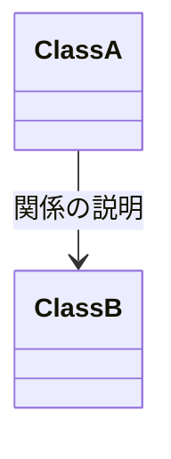
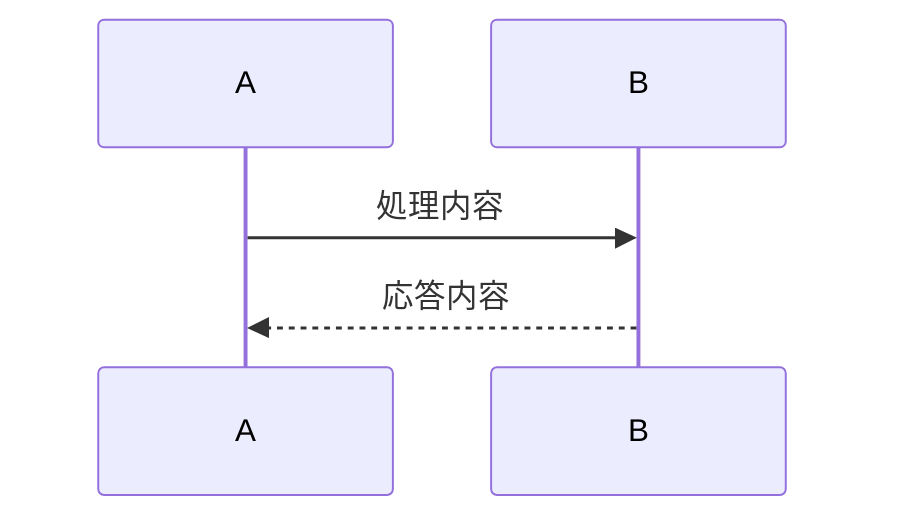

## 説明対象

$ARGUMENTS

## Steps

1. $ARGUMENTS に登場する概念を平たい言葉で列挙. この時簡単な役割を「登場人物」に記述.
2. 登場人物間の関係を中学生でも分かるように、mermaidのクラス図として「登場人物の関係」に記述.
3. コードがある場合は登場人物、関係がそれぞれ実際にどこに該当するかを「具体」に説明.
4. $ARGUMENTS に関する代表的な処理フローを、mermaidのシーケンス図として「フロー」に記述.

## Output Format

````
1. 登場人物

| 名前 | 役割 |
| --- | --- |
| ... | ... |

2. 登場人物の関係



3. 具体

...該当箇所、具体的なコードを記述

4. フロー


````
